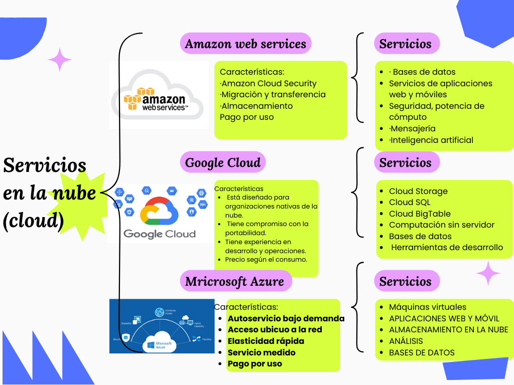

# Características e importancia de los servicios en la nube 

Los servicios de nube son infraestructuras, plataformas o sistemas de software que alojan los proveedores externos y que se ponen a disposición de los usuarios a través de Internet. 



```{Tecnologias de la informacion}
```
